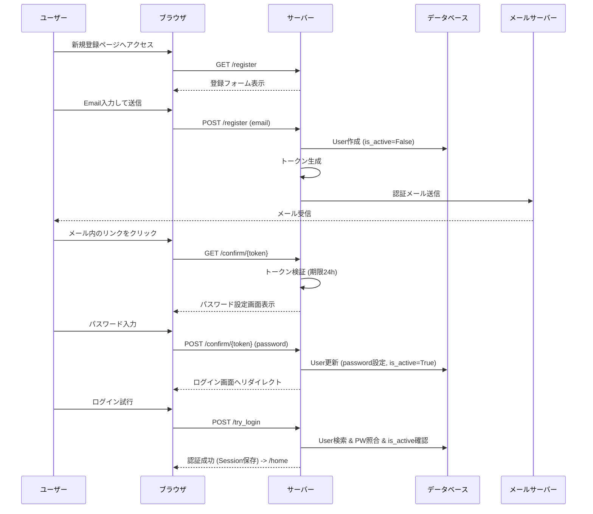
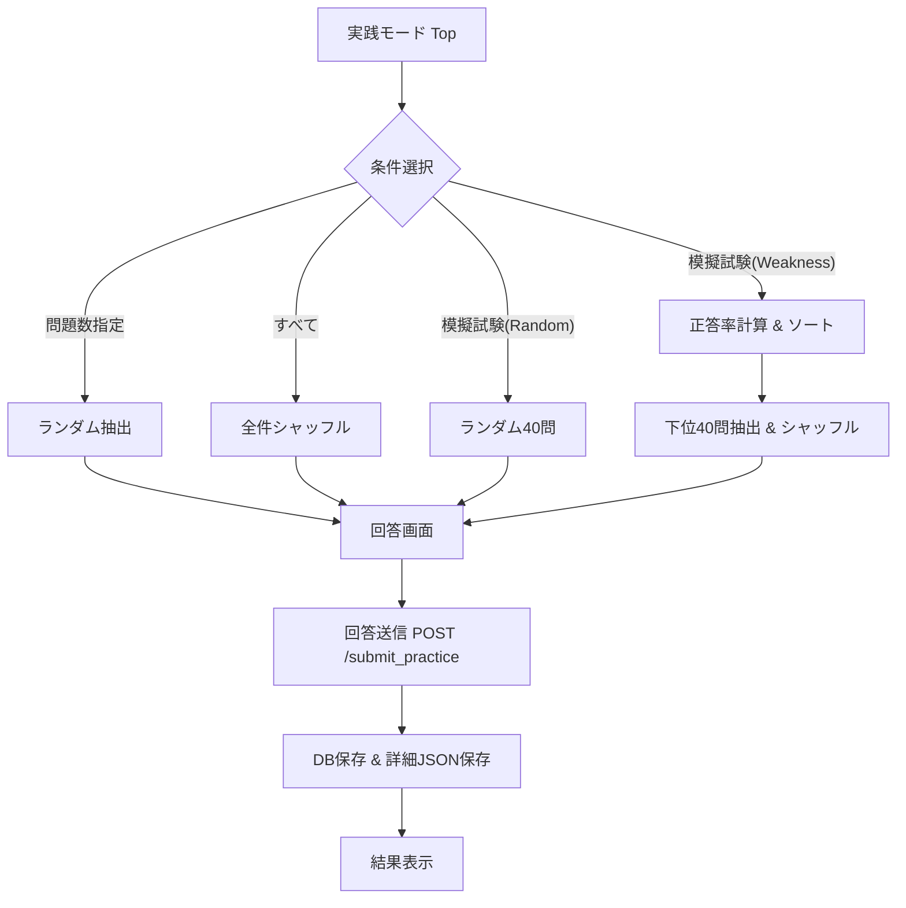
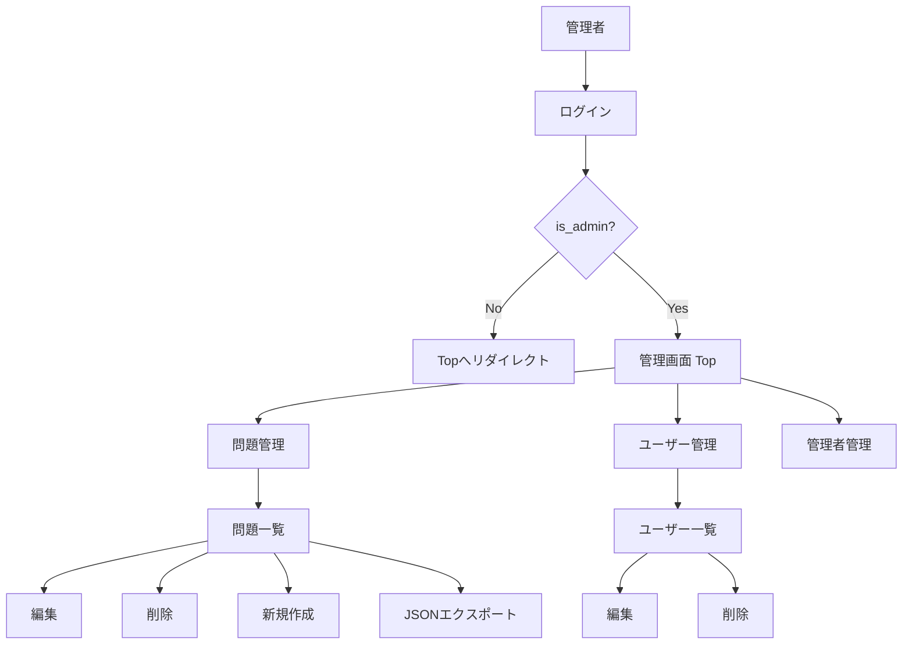
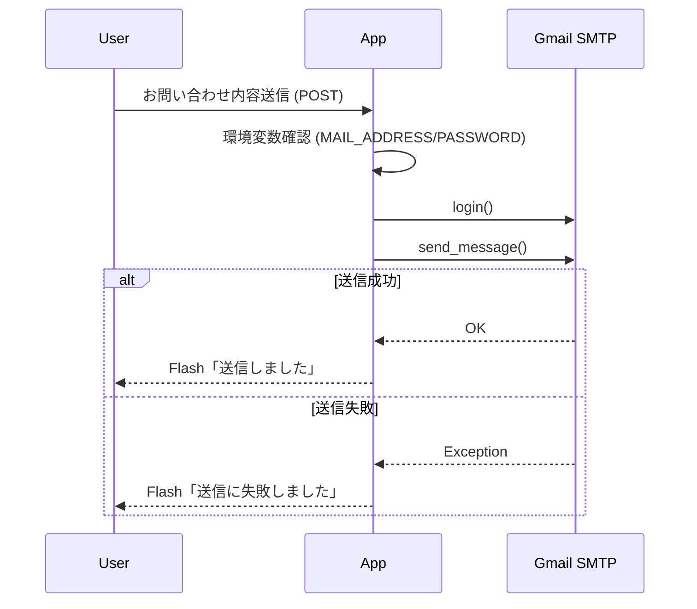
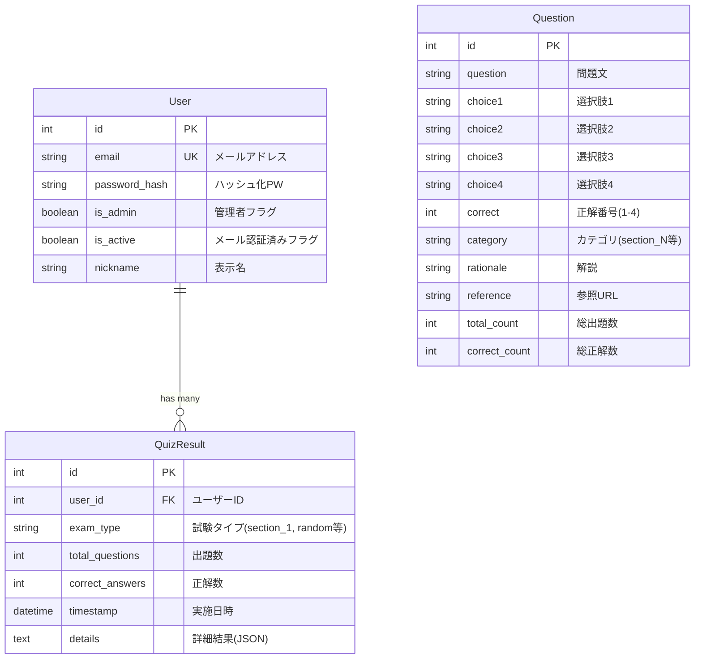

# Pythonエンジニア認定試験 クイズアプリ 仕様書

## 1. 概要
本アプリケーションは、Pythonエンジニア認定試験の学習を支援するためのWebベースのクイズプラットフォームです。ユーザーは章別の学習や模擬試験形式での演習を行い、自身の学習進捗を可視化することができます。

### アプリの目的
- Pythonエンジニア認定試験合格に向けた知識習得と演習
- 弱点の可視化と重点的な復習支援

### 想定ユーザー
- **一般ユーザー**: 試験勉強を行う学習者。問題演習、履歴確認、分析機能を利用。
- **管理者**: 問題データの管理、ユーザー管理、システム運用を行う担当者。

### 主要機能一覧
- **認証**: メールアドレスによる新規登録（メール認証必須）、ログイン、パスワードリセット
- **学習**:
    - 章別テスト（特定の章を選択して出題）
    - 実践モード（出題数指定、全問、模擬試験、弱点克服）
- **分析**: 週次学習推移、章別正答率、模擬試験履歴のグラフ表示
- **管理**: 問題データのCRUD、CSV/JSONエクスポート、ユーザー・管理者アカウントの管理
- **その他**: お問い合わせフォーム

---

## 2. 技術構成
現状のコードベースに基づく技術スタックは以下の通りです。

- **言語**: Python
- **Webフレームワーク**: Flask
- **データベース**: SQLite (ファイル名: `quiz.db`)
- **ORM**: SQLAlchemy (Flask-SQLAlchemy)
- **マイグレーション**: Flask-Migrate
- **テンプレートエンジン**: Jinja2
- **認証方式**: Flask Session (`user`, `is_admin` キーを使用)
- **パスワードハッシュ**: Werkzeug security (`generate_password_hash`, `check_password_hash`)
- **メール送信**: `smtplib` (Gmail SMTP server: `smtp.gmail.com:587`)
- **環境変数**:
    - `MAIL_ADDRESS`: 送信元メールアドレス
    - `MAIL_PASSWORD`: 送信元メールパスワード
- **トークン生成**: `itsdangerous.URLSafeTimedSerializer` (シークレットキー: ソースコード内に固定 `test123` ※要改善)

---

## 3. 画面一覧

| URL | テンプレート | 概要 | アクセス制御 |
| :--- | :--- | :--- | :--- |
| `/` | `login.html` | ログイン画面。アプリの入り口。 | 全員 |
| `/register` | `register.html` | 新規登録（メール送信）。 | 全員 |
| `/confirm/<token>` | `set_password.html` | メール認証完了＆パスワード設定。 | トークン保持者 |
| `/home` | `home.html` | ログイン後のホーム画面。 | 要ログイン |
| `/mypage` | `mypage.html` | ユーザー情報確認、ニックネーム・PW変更。 | 要ログイン |
| `/material` | `material.html` | 学習資料ページ（現状プレースホルダー）。 | 要ログイン |
| `/section_test` | `section_test.html` | 章別テスト選択 / 問題回答画面。 | 要ログイン |
| `/submit_section` | `result.html` | 章別テストの結果表示・採点処理。 | 要ログイン(POST) |
| `/practice` | `practice_test.html` | 実践モード設定 / 問題回答画面。 | 要ログイン |
| `/submit_practice` | `result.html` | 実践モードの結果表示・採点処理。 | 要ログイン(POST) |
| `/analytics` | `analytics.html` | 学習分析ダッシュボード。 | 要ログイン |
| `/analytics_data` | (JSON) | 分析用データを返すAPI。 | 要ログイン |
| `/support` | `support.html` | お問い合わせフォーム。 | 全員（ログイン時はEmail自動入力） |
| `/admin` | `admin.html` | 管理画面トップ。 | 要管理者権限 |
| `/admin/questions` | `admin_questions.html` | 問題一覧・検索・削除。 | 要管理者権限 |
| `/admin/question/new` | `new_question.html` | 新規問題作成。 | 要管理者権限 |
| `/admin/question/<id>` | `edit_question.html` | 問題編集。 | 要管理者権限 |
| `/admin/export` | (JSON File) | 全問題をJSON形式でダウンロード。 | 要管理者権限 |
| `/admin/users` | `admin_users.html` | 一般ユーザー一覧・削除。 | 要管理者権限 |
| `/admin/admins` | `admin_admins.html` | 管理者一覧・削除。 | 要管理者権限 |

---

## 4. 認証・ユーザー登録仕様

本システムでは、メールアドレスの有効性を確認するために「メール認証フロー」を採用しています。

### 登録フロー詳細
1. **メール入力**: ユーザーが `/register` でメールアドレスを入力。
2. **仮登録**: DBに `is_active=False` でユーザーレコードを作成（パスワード未設定）。
3. **トークン生成**: `itsdangerous` を使用し、Emailを含んだ署名付きトークンを生成。
4. **メール送信**: 認証URL（`/confirm/<token>`）を記載したメールを送信。
5. **認証・本登録**:
    - ユーザーがURLにアクセス。
    - トークンの署名と有効期限（**24時間**）を検証。
    - パスワード入力フォームを表示。
    - パスワード保存時に `is_active=True` に更新し、アカウントを有効化。

### 例外処理
- **既存ユーザー**: 既に登録済みのEmailの場合、現在はエラーを表示せず処理が進むように見えるが、内部的には新規レコード作成はスキップされる（`User.query.filter_by(email=email).first()` でチェック）。
- **トークン期限切れ**: 「リンクの有効期限が切れています」と表示。
- **無効なトークン**: 「無効なリンクです」と表示。

### シーケンス図（新規登録〜ログイン）



---

## 5. クイズ仕様

### 5.1 章別テスト (Section Test)
特定の章（カテゴリ）に絞って問題を解くモードです。

- **URL**: `/section_test`
- **入力パラメータ**: `category` (クエリパラメータ)
    - 指定なし: 章選択画面を表示（1〜16章）
    - 指定あり: 指定されたカテゴリ（例: `section_1`）の問題を全件取得
- **特殊条件**: `category=all` の場合は `category LIKE 'section_%'` の全問題を取得。
- **採点ロジック**:
    - フォーム送信された `question_{id}` の値（1〜4）と `Question.correct` を比較。
    - 未選択は「未回答」として不正解扱い。
- **結果保存**: `QuizResult` テーブルに保存。
    - `exam_type`: `section_{category}` (例: `section_1`, `section_all`)
    - `details`: 各問題の成否詳細をJSONで保存。

#### ユーザーフロー（章別テスト）

```mermaid
flowchart TD
    A[章別テスト Top] --> B{カテゴリ選択済み?}
    B -- No --> C[章一覧表示 (1-16章)]
    C --> D[カテゴリ選択]
    D --> E
    B -- Yes --> E[問題データ取得]
    E --> F[回答画面表示]
    F --> G[回答送信 POST /submit_section]
    G --> H[採点処理]
    H --> I[DB保存 (QuizResult)]
    I --> J[結果画面表示]
```

### 5.2 実践モード (Practice)
問題数や出題形式を指定して演習を行うモードです。

- **URL**: `/practice`
- **オプション選択**:
    - 問題数: 5, 10, 20, 30, 40, 50, 100, すべて
    - 模擬試験モード（固定オプション）:
        - `40_random_mock`: ランダムに40問
        - `40_weakness_mock`: 弱点克服（正答率が低い順に40問）
- **出題ロジック**:
    - **Random / 指定数**: 全問題から `random.sample` で抽出。
    - **Weakness (弱点)**: 全問題を `correct_count / total_count` (正答率) で昇順ソートし、上位40問を抽出後シャッフル。
        - ※ `total_count == 0` の問題は正答率 0.0 として扱う（最優先で出題）。
- **結果保存**:
    - `exam_type`: `random` または `weakness` など選択したモード名。

#### 実践モード 分岐フロー



---

## 6. 管理機能 (Admin)

管理者権限（`is_admin=True`）を持つユーザーのみアクセス可能な領域です。

### 機能詳細
- **ダッシュボード**: `/admin`
- **問題管理**: `/admin/questions`
    - ページネーション（20件/ページ）
    - フィルタ: 章（section_1〜16, all）
    - アクション: 編集、削除
- **問題作成/編集**:
    - 必須項目: 問題文, 選択肢1-4, 正解番号, カテゴリ
    - 任意項目: 解説, 参照URL
- **エクスポート**: `/admin/export`
    - 全問題をJSONファイル (`questions_export.json`) としてダウンロード。
- **ユーザー管理**:
    - 一般ユーザー (`admin_users.html`) と 管理者 (`admin_admins.html`) を分離して管理。
    - 新規作成、編集（Email/PW）、削除が可能。
    - **制約**: 管理者は自分自身を削除できない。

#### 管理者操作フロー



---

## 7. 分析 (Analytics)

ユーザーの学習履歴を可視化します。データは `/analytics_data` APIからJSON形式で提供され、フロントエンド（Chart.js等と推測）で描画されます。

### データ生成ロジック (`/analytics_data`)

1. **Weekly Trend (過去8週間)**
   - 現在から過去8週間分のデータを週単位で集計。
   - 各週の `QuizResult` の `correct_answers` 合計 / `total_questions` 合計 で正答率を算出。
   - 結果がない週は 0%。

2. **Section Rate (過去30日)**
   - 直近30日の全結果を取得。
   - `details` (JSON) カラムがある場合: 各問題の `category` を解析して章ごとに集計。
   - `details` がない場合 (旧データ): `exam_type` 文字列（例: `section_5`）から章を判定。
   - 1〜16章ごとの正答率を算出。

3. **Mock Trend (Random / Weakness)**
   - `exam_type` が `random` または `weakness` の履歴を最新10件取得。
   - 時系列順（古い順）に並べ替えて配列化。
   - ラベル（日時）、スコア（正解数）、正答率（%）を返す。

#### データ生成フロー

```mermaid
flowchart TD
    Req[GET /analytics_data] --> Auth{ログイン中?}
    Auth -- No --> Empty[{}]
    Auth -- Yes --> Fetch[UserのQuizResult取得]
    
    Fetch --> Weekly[週次集計処理]
    Weekly --> WCalc[8週間分の正答率算出]
    
    Fetch --> Section[章別集計処理]
    Section --> SParse[details JSON解析 or exam_type解析]
    SParse --> SCalc[章ごとの正答率算出]
    
    Fetch --> Mock[模擬試験履歴]
    Mock --> MFilter[Random/Weakness抽出]
    MFilter --> MLimit[最新10件 & ソート]
    
    WCalc & SCalc & MLimit --> Resp[JSONレスポンス]
```

---

## 8. お問い合わせ (Support)

ユーザーからのフィードバックや質問を受け付ける機能です。

- **URL**: `/support`
- **Method**: GET (表示), POST (送信)
- **メール仕様**:
    - **To**: `MAIL_ADDRESS` (管理者)
    - **From**: `MAIL_ADDRESS` (システムメール)
    - **Reply-To**: ユーザーの入力したEmail
    - **Subject**: `【お問い合わせ】{category} ({name}様)`
- **完了後の挙動**: フラッシュメッセージを表示して `/support` へリダイレクト。



---

## 9. データモデル (ER図)

### 主要エンティティ

1. **User (users)**: ユーザーアカウント
2. **Question (questions)**: クイズ問題
3. **QuizResult (quiz_results)**: 受験履歴

### ER図



---

## 10. APIエンドポイント定義詳細

| Method | Path | 認可 | 入力 (Args/Form) | 処理概要 | DB更新 |
| :--- | :--- | :--- | :--- | :--- | :--- |
| GET | `/section_test` | User | `category` (opt) | 指定カテゴリの問題を取得して表示。 | なし |
| POST | `/submit_section` | User | `category`, `question_{id}`... | 採点し、`section_XX` として結果保存。 | Insert `QuizResult` |
| GET | `/practice` | User | `num_questions`, `test_type` | 指定条件で問題を抽出し表示。 | なし |
| POST | `/submit_practice` | User | `all_q_ids`, `question_{id}`... | IDリスト順に問題を再取得して採点。 | Insert `QuizResult` |
| GET | `/analytics_data` | User | なし | 分析用グラフデータをJSONで返却。 | なし |
| POST | `/update_nickname` | User | `nickname` | ユーザーのニックネームを更新。 | Update `User` |
| POST | `/update_password` | User | `current`, `new`, `confirm` | 現在のPWを確認後、新しいPWを設定。 | Update `User` |

---

## 11. 制約・注意点・改善提案

### 現状の制約と注意点
1. **セキュリティ**:
    - `app.secret_key` がコード内で `"test123"` に固定されているため、セッションハイジャックやCSRFのリスクがある（本番環境では必ず変更が必要）。
    - CSRF保護（Flask-WTF等）が導入されていない。
2. **環境依存**:
    - メール送信設定が `os.environ` に依存しているが、`.env` 読み込みがコメントアウトされており、環境変数の設定漏れでエラーになる可能性がある。
3. **データ整合性**:
    - `QuizResult.details` はJSON文字列として保存されており、構造変更に弱い。
    - `Question` の削除時、関連する `QuizResult` の整合性はDBレベル（外部キー制約）で担保されていない可能性がある（SQLiteの設定依存）。

### 今後の改善提案
- **セキュリティ強化**: Secret Keyの環境変数化、Flask-WTFによるCSRF対策。
- **バリデーション**: 入力値（パスワード強度、文字数制限など）のバリデーション強化。
- **非同期処理**: メール送信の非同期化（Celery等）によるレスポンス向上。
- **アーキテクチャ**: `details` カラムの正規化、またはNoSQL的な利用方針の明確化。
- **テスト**: 単体テスト・統合テストの追加。

---

## 生成した図の一覧
1. **シーケンス図（新規登録〜ログイン）**
2. **ユーザーフロー（章別テスト）**
3. **実践モード 分岐フロー**
4. **管理者操作フロー**
5. **データ生成フロー (Analytics)**
6. **シーケンス図（お問い合わせ）**
7. **ER図**
