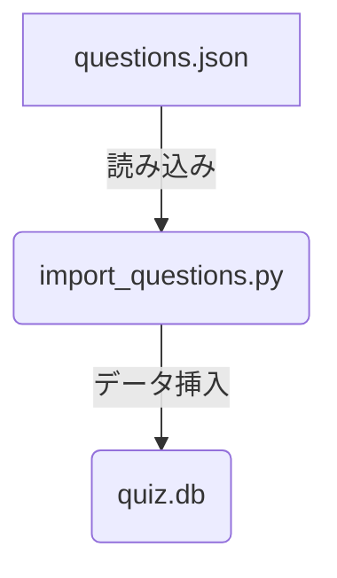
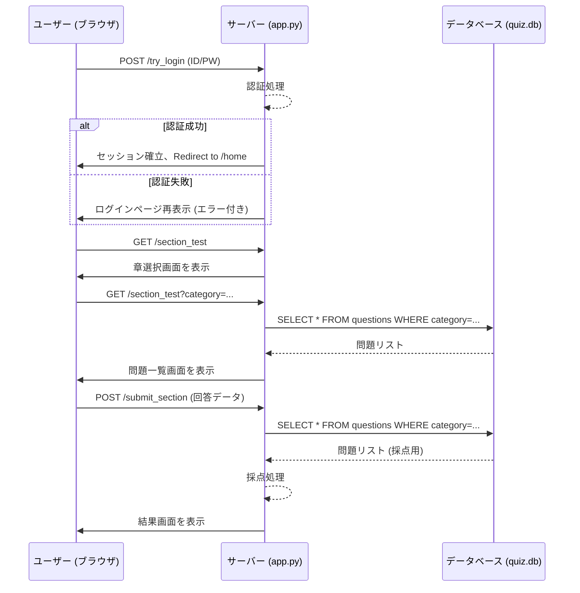

# プロジェクト仕様書：Python MyQuest

## 1. 概要

### 1.1. プロジェクトの目的

**Python MyQuest**は、Pythonの知識を体系的に学習し、その理解度を測定することを目的としたWebアプリケーションである。ユーザーは提供される教材で学習し、章ごとのテストやランダム出題の模擬試験を通じて自身の知識レベルを確認・向上させることができる。

### 1.2. プロジェクトの構成

本プロジェクトは、Flaskフレームワークを基盤としたサーバーサイドアプリケーションとして構築されている。データベースにはSQLiteを使用し、SQLAlchemyを介してデータの永続化を行う。フロントエンドは、Bootstrap 5を利用したレスポンシブデザインのHTMLテンプレートで構成される。

---

## 2. 全体の情報の流れ

本アプリケーションにおける情報の流れは、大きく分けて「データ準備フェーズ」と「ユーザー利用フェーズ」の2つに分類される。

### 2.1. データ準備フェーズ

クイズの問題データは、以下の手順でデータベースに登録される。

1.  **JSONファイル作成**: `questions.json` ファイルに、問題文、4つの選択肢、正解の選択肢番号、カテゴリ（章、または練習問題）を定義する。問題文の追加、修正についてもJSONファイルにて管理する。
2.  **インポートスクリプト実行**: `python import_questions.py` を実行する。
3.  **データベースへの登録**: スクリプトが `questions.json` を読み込み、Flaskアプリケーションのコンテキスト内で `Question` モデルを通じて `quiz.db` というSQLiteデータベースに各問題をレコードとして挿入する。

### 2.2. ユーザー利用フェーズ

ユーザーがアプリケーションを利用する際の典型的な情報の流れは以下の通り。

1.  **ログイン**: ユーザーはログインページで認証情報を入力する。サーバーはそれを検証し、成功すればセッションを確立してホームページにリダイレクトする。
2.  **テスト受験**: ユーザーがホームページからテストの種類（章末テスト/模擬試験）を選択する。
3.  **問題取得と表示**: サーバーはリクエストに応じてデータベースから適切な問題を抽出し、HTMLとしてレンダリングしてユーザーのブラウザに表示する。
4.  **回答と採点**: ユーザーが回答を提出すると、サーバーはそれを受け取り、正解と比較して採点を行う。
5.  **結果表示**: サーバーは採点結果を整形し、詳細な結果ページを生成してユーザーにフィードバックする。

---

## 3. 機能一覧

| 機能分類     | 機能名       | 概要                                                               |
| :----------- | :----------- | :----------------------------------------------------------------- |
| **ユーザー管理** | ログイン/ログアウト | 固定のユーザー情報に基づき、セッションを管理する。                 |
|              | ユーザー種別   | 学習者(student)と管理者(admin)の2種類が存在する。                  |
| **学習**     | 教材閲覧     | 静的なHTMLで記述された教材ページを表示する。                       |
| **テスト**     | 章末テスト   | 任意の章、または全範囲から問題が出題され、最後にまとめて採点される。 |
|              | 模擬試験     | 全ての練習問題からランダムに1問が出題され、即時採点される。        |
|              | 結果表示     | テストの総合成績と、各問題の詳細な正誤情報を表示する。             |
| **管理者機能** | 管理者画面   | 管理者専用のメニューページを表示する。                             |

---

## 4. `app.py` の仕様

`app.py`は本アプリケーションの中核を担うファイルであり、URLのルーティング、ビジネスロジックの実行、画面のレンダリングを担当する。

### 4.1. 初期設定とグローバル変数

-   `app = Flask(__name__)`: Flaskアプリケーションのインスタンスを生成。
-   `app.secret_key = "test123"`: セッション管理に使用するシークレットキー。**本番環境では推測困難な値に変更する必要がある。**
-   `app.config["SQLALCHEMY_DATABASE_URI"]`: データベースの接続先として `quiz.db` を指定。
-   `db.init_app(app)` / `db.create_all()`: FlaskアプリケーションとSQLAlchemyを紐付け、起動時にテーブルを自動生成する。
-   `USERS`: ログイン認証に使用される、メールアドレスをキー、パスワードを値とする辞書型オブジェクト。

### 4.2. ルート（エンドポイント）詳細

#### **GET `/`**
- **関数:** `login()`
- **目的・役割:** アプリケーションの入り口として、ログインページを表示する。
- **機能:** `login.html` をレンダリングしてクライアントに返す。

#### **POST `/try_login`**
- **関数:** `try_login()`
- **目的・役割:** ユーザーからのログイン情報を検証し、認証処理を行う。
- **引数:** なし。フォームデータから値を取得する。
- **内部変数:**
    - `email`: フォームから受け取ったメールアドレス。
    - `pw`: フォームから受け取ったパスワード。
- **情報の流れ:**
    1.  クライアントが送信したフォームデータから `email` と `pw` を取得。
    2.  `USERS` ディクショナリに `email` が存在し、かつパスワードが一致するか検証。
    3.  **成功時:** `session["user"]` に `email` を格納し、`/home` へリダイレクトする。
    4.  **失敗時:** `error` メッセージを付与して `login.html` を再レンダリングする。

#### **GET `/logout`**
- **関数:** `logout()`
- **目的・役割:** ユーザーセッションを破棄し、安全にログアウトさせる。
- **機能:** `session.clear()` を呼び出してセッション情報を全て削除し、ログインページ (`/`) へリダイレクトする。

#### **GET `/home`**
- **関数:** `home()`
- **目的・役割:** ログイン後のメインメニューとなるホームページを表示する。
- **機能:**
    1.  `session` に `user` が存在するか（ログイン済みか）をチェック。未ログインの場合は `/` へリダイレクト。
    2.  `home.html` をレンダリングする。この際、テンプレート内でユーザー名を表示するために `user=session["user"]` を渡す。

#### **GET `/material`**
- **関数:** `material()`
- **目的・役割:** 学習教材コンテンツを表示する。
- **機能:** ログインチェック後、`material.html` をレンダリングする。

#### **GET `/section_test`**
- **関数:** `section_test()`
- **目的・役割:** 章末テストの「範囲選択画面」と「問題解答画面」の出し分けを行うコントローラー。
- **引数:** なし。クエリパラメータから値を取得する。
- **内部変数:**
    - `category`: `request.args.get('category')` で取得するクエリパラメータ。出題範囲を指定する。
    - `chapters`: `category` が指定されていない場合に、章選択肢リスト（1〜16）を格納する。
    - `q_list`: `category` に基づいてデータベースから取得した `Question` オブジェクトのリスト。
- **情報の流れ:**
    1.  ログインチェックを行う。
    2.  URLに `category` クエリパラメータが存在しない場合：
        -   章選択メニューを表示するため、`chapters` リストを `section_test.html` に渡してレンダリングする。
    3.  `category` クエリパラメータが存在する場合：
        -   `category` の値が `'all'` ならば全章の問題、そうでなければ指定された章の問題を `Question.query` を使ってデータベースから取得する。
        -   取得した問題リスト `q_list` を `section_test.html` に渡し、問題解答画面をレンダリングする。

#### **POST `/submit_section`**
- **関数:** `submit_section()`
- **目的・役割:** 章末テストのユーザーの回答を受け取り、採点処理を実行して結果を表示する。
- **引数:** なし。フォームデータから値を取得する。
- **内部変数:**
    - `category`: フォームから受け取った出題範囲。
    - `results`: 各問題の正誤やユーザーの回答を格納する辞書のリスト。
    - `score`: 正解数をカウントする整数。
    - `q_list`: 採点対象の問題リスト。
    - `selected_choice_val`: 各問題 (`q.id`) に対するユーザーの回答（選択肢の番号）。
- **情報の流れ:**
    1.  ログインチェックを行う。
    2.  フォームデータから `category` と各問題の回答 (`question_{q.id}`) を受け取る。
    3.  `category` に基づいて、解答された問題のリスト `q_list` をデータベースから再取得する。
    4.  `q_list` をループ処理し、各問題に対してユーザーの回答と `q.correct` を比較する。
    5.  正解なら `score` をインクリメントする。
    6.  各問題の結果（問題オブジェクト、ユーザー回答、正誤など）を `results` リストに追加する。
    7.  最終的な `score`、`total`（総問題数）、`results` リストを `result.html` に渡して結果ページをレンダリングする。

#### **GET, POST `/practice`**
- **関数:** `practice()`
- **目的・役割:** 模擬試験の機能を提供する。GETで問題を表示し、POSTで回答を処理する。
- **メソッド:** `GET`, `POST`
- **情報の流れ:**
    - **GET時:**
        1.  ログインチェックを行う。
        2.  `practice` カテゴリの全問題をデータベースから取得する (`q_list`)。
        3.  `random.choice(q_list)` でランダムに1問を選出する (`q`)。
        4.  `practice.html` に問題データ (`question`, `choices`, `correct`) を渡してレンダリングする。
    - **POST時:**
        1.  フォームからユーザーの回答 `choice` と、正解 `correct` を受け取る。
        2.  両者を比較して正誤を判定 (`result`)。
        3.  判定結果 (`ok=True/False`) をクエリパラメータに付けて `/result` へリダイレクトする。

#### **GET `/result`**
- **関数:** `result()`
- **目的・役割:** 模擬試験の簡易的な結果（正解か不正解か）を表示する。
- **内部変数:** `ok`: `request.args.get("ok")` で取得する真偽値。
- **機能:** ログインチェック後、`ok` の値に基づいて `result.html` の表示を一部制御する（ただし、テンプレートの主目的は章末テストの詳細結果表示）。

#### **GET `/admin`**
- **関数:** `admin()`
- **目的・役割:** 管理者専用ページへのアクセス制御と表示を行う。
- **機能:**
    1. `session.get("user")` が `"admin@example.com"` と一致するか検証。
    2. 一致しない場合はログインページ (`/`) へリダイレクトする。
    3. 一致する場合は `admin.html` をレンダリングする。

---

## 5. データベース設計

### `questions` テーブル
アプリケーションのクイズデータを格納する唯一のテーブル。

| カラム名   | データ型      | 説明                                   |
| :--------- | :------------ | :------------------------------------- |
| `id`       | Integer       | 主キー (自動採番)                      |
| `question` | String(300)   | 問題文                                 |
| `choice1`  | String(200)   | 選択肢1                                |
| `choice2`  | String(200)   | 選択肢2                                |
| `choice3`  | String(200)   | 選択肢3                                |
| `choice4`  | String(200)   | 選択肢4                                |
| `correct`  | Integer       | 正解の選択肢番号 (1, 2, 3, 4のいずれか) |
| `category` | String(50)    | 問題のカテゴリ (例: `section_1`, `practice`) |

---

## 6. 画面一覧

-   **`/` (login.html):** ログインページ。メールアドレスとパスワード入力フォームを設置。
-   **`/home` (home.html):** ログイン後のメニューページ。「教材を見る」「章末テスト」「模擬試験」「管理者画面(管理者のみ)」へのリンクをカード形式で表示。
-   **`/material` (material.html):** 教材ページ。
-   **`/section_test` (section_test.html):** 章末テストページ。動的に「範囲選択フォーム」と「問題解答フォーム」を切り替えて表示。
-   **`/practice` (practice.html):** 模擬試験の問題解答ページ。
-   **`/result` (result.html):** テスト結果表示ページ。総合スコアと問題ごとの詳細な正誤情報を表示。
-   **`/admin` (admin.html):** 管理者用ページ。

