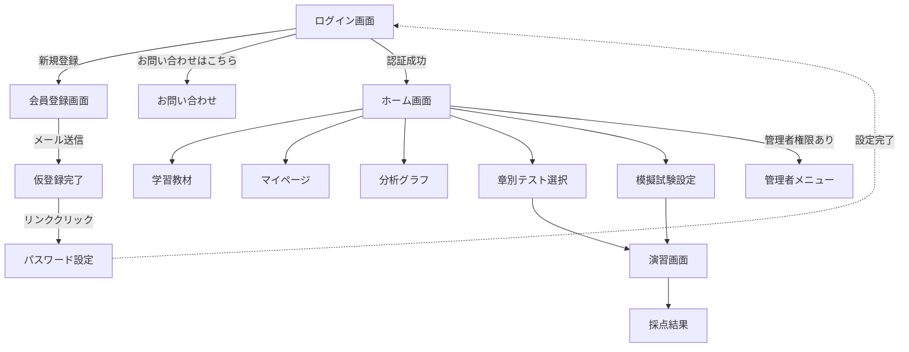

# Python MyQuest アプリケーション仕様書

## 1. アプリ概要

- **アプリ名**: Python MyQuest
- **目的**: Python 3 エンジニア認定基礎試験（基礎レベル）の合格を目指す学習者のための、演習・実力確認プラットフォーム。
- **主要ターゲット**:
    - Python初学者。
    - Python 3 エンジニア認定基礎試験の受験予定者。
    - 自身の苦手分野を把握し、効率的に学習したいエンジニア。

## 2. 機能一覧

| カテゴリ | 機能名 | 詳細説明 |
| --- | --- | --- |
| **認証・管理** | 会員登録（メール認証） | トークン認証による安全なパスワード設定・本登録フロー。 |
|  | ログイン / ログアウト | メールアドレスとパスワードによる認証。セッション管理。 |
|  | マイページ | ニックネームおよびパスワードの変更機能。 |
|  | 管理者機能 | 問題データ(CRUD)、ユーザー、管理者の管理。 |
| **学習・演習** | 章別テスト | 全16章から特定の章を選択。体系的な学習確認用。 |
|  | 模擬試験（ランダム） | 全問題からランダムに40問出題。本番試験想定。 |
|  | 模擬試験（苦手克服） | 過去の正誤率が低い問題を優先的に40問出題。 |
| **分析・記録** | 成績保存 | スコア、日時、個別の正誤詳細(JSON)をDBに保存。 |
|  | 成績分析 | 週ごとの学習推移、章別正答率を可視化。 |
| **その他** | お問い合わせ | 管理者（MAIL_ADDRESS）へのメール送信機能。 |

## 3. 画面遷移図



## 4. 業務フロー / ロジック

### 4.1. ユーザー登録・メール認証フロー

不正な登録を防ぐため、`itsdangerous` を用いたトークン認証を採用しています。

sequenceDiagram
participant U as ユーザー
participant S as Flaskアプリ
participant E as SMTPサーバー

```
U->>S: 会員登録 (メールアドレス入力)
S->>S: トークン生成 (itsdangerous)
S->>E: 認証メール送信 (smtplib)
E-->>U: メール受信
U->>S: リンククリック
S->>S: トークン検証 (24時間有効)
S-->>U: パスワード設定画面表示
U->>S: パスワード入力
S->>S: ハッシュ化保存 & 有効化 (is_active=True)

```

### 4.2. クイズ解答・分析反映フロー

解答データは `QuizResult` モデルに JSON 形式で詳細に保存されます。

flowchart TD
Submit[解答送信 POST] --> Grade[サーバーサイド採点]
Grade --> JSON[詳細データをJSON文字列に変換]
JSON --> SaveDB[(QuizResultテーブルへ保存)]

```
subgraph データ可視化
LoadDB[(履歴取得)] --> Calc[週次正答率/章別レート集計]
Calc --> Chart[Chart.js でグラフ描画]
end

```

## 5. データ構造

### User (users) テーブル

ユーザー認証情報と状態を管理します。
| カラム名 | 型 | 説明 |
| :--- | :--- | :--- |
| id | Integer | 主キー。 |
| email | String | ログインID（ユニーク）。 |
| password_hash | String | ハッシュ化されたパスワード。 |
| is_active | Boolean | メール認証完了フラグ。 |
| nickname | String | 表示用ニックネーム。 |

### Question (questions) テーブル

クイズの問題文、選択肢、および統計データを保持します。
| カラム名 | 型 | 説明 |
| :--- | :--- | :--- |
| id | Integer | 主キー。 |
| question | String | 問題文。 |
| choice1 ~ 4 | String | 選択肢。 |
| correct | Integer | 正解番号（1-4）。 |
| rationale | Text | 解説文。 |
| total_count | Integer | 総出題回数。 |
| correct_count | Integer | 総正解回数。 |

### QuizResult (quiz_results) テーブル

試験実施履歴を JSON 形式（detailsカラム）で詳細に保存します。
| カラム名 | 型 | 説明 |
| :--- | :--- | :--- |
| id | Integer | 主キー。 |
| user_id | Integer | 外部キー (User.id)。 |
| exam_type | String | テストの種類 (random, section_1 等)。 |
| details | Text | 各問の正誤詳細 (JSON形式文字列)。 |
| timestamp | DateTime | 実施日時。 |

## 6. 技術スタック

| **カテゴリ** | **使用技術** |
| --- | --- |
| **言語** | Python 3.12 (Server) / 3.14 (Local)。 |
| **フレームワーク** | Flask。 |
| **データベース** | SQLite / SQLAlchemy (ORM)。 |
| **メール送信** | SMTP (Gmail SMTPサーバー)。 |
| **フロントエンド** | Jinja2, Bootstrap 5, Chart.js。 |
| **実行環境** | PythonAnywhere (WSGI) |